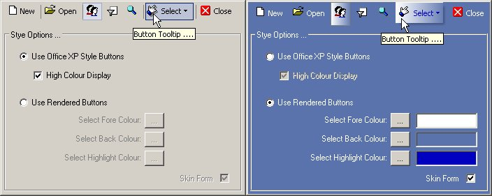



## XP Style / Rendered \(Skinned\) Toolbar Buttons Control

### Description

This control lets you have Office XP Style or Rendered Toolbar buttons (useful for skinning forms). The style can be switched dynamically if you like. See the 'SetButtonStyle' procedure on Form1 for details on using the control. The control includes Steve McMahon's excellent vbAccelerator Subclassing module, and some snippets picked up from Planet Source Code - thanks to all! Feel free to use and/or improve the control - comments and suggestions very welcome. Hope you find it useful!
 
### More Info
 

             |
---                |---
**Submitted On**   |2003-11-13 06:08:04
**By**             |[James Kerr](https://github.com/Planet-Source-Code/PSCIndex/blob/master/ByAuthor/james-kerr.md)
**Level**          |Intermediate
**User Rating**    |5.0 (30 globes from 6 users)
**Compatibility**  |VB 6\.0
**Category**       |[Custom Controls/ Forms/  Menus](https://github.com/Planet-Source-Code/PSCIndex/blob/master/ByCategory/custom-controls-forms-menus__1-4.md)
**World**          |[Visual Basic](https://github.com/Planet-Source-Code/PSCIndex/blob/master/ByWorld/visual-basic.md)
**Archive File**   |[XP\_Style\_\_16713411132003\.zip](https://github.com/Planet-Source-Code/james-kerr-xp-style-rendered-skinned-toolbar-buttons-control__1-49869/archive/master.zip)

